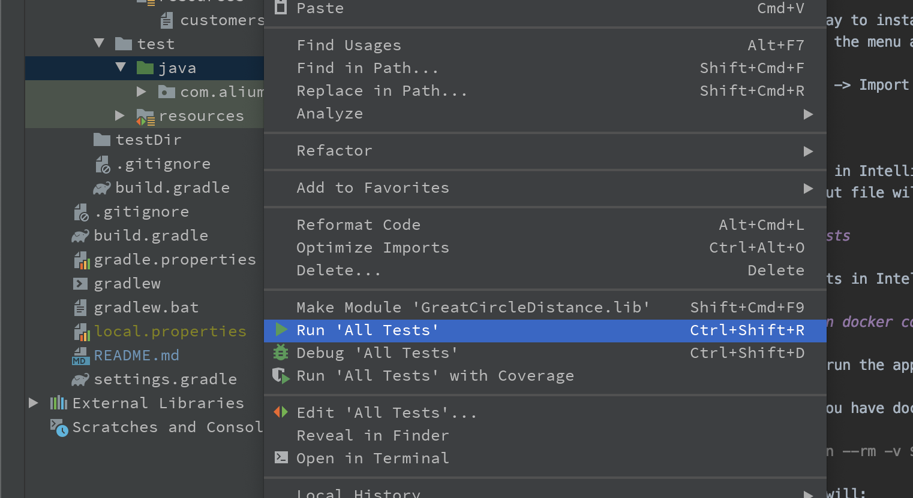

# GreatCircleDistance
Simple Kotlin program that:
 - reads a list of customers
 - Calculates the distance of each customer from a specified set of coordinates using the Haversine formula to calculate the great-circle distance between two points on a sphere.
 - output the names and user ids of matching customers (within 100km), sorted by User ID in ascending order.

## Dependencies (Environment)

The application requires:
- Kotlin 1.3
- JUnit
- MockK
- Truth
- Gson
- Konveyor

## Installation

The easiest way to install and execute the program is to use IntelliJ IDEA 2020.1 / Android Studio 4.1 Canary 8.
Click through the menu as follows:

- File -> New -> Import Project


   
## Usage

- Run program in IntelliJ IDEA.
- Result output file will be at ```/src/main/resources```

## Running Tests

- Execute tests in IntelliJ as shown in the photo below:



#Sample Output
A sample output file can be found at https://github.com/aliumujib/GreatCircleDistance/blob/master/lib/src/main/resources/results_1590975440303.txt

## Project structure
 
Entry class is located at ```/src/main/java/com/aliumujib/greatcircledistance/lib/main.kt```, it is a simple main.kt class.

Models that can be used for data and result representation are under ```/src/main/java/com/aliumujib/greatcircledistance/lib/models```.

There is a separate class encapsulating distance calculation - ```/src/main/java/com/aliumujib/greatcircledistance/lib/distances/DistanceCalculator.kt```.

The classe responsible for writing results to a file - ```/src/main/java/com/aliumujib/greatcircledistance/lib/sotrage/FileStore.kt```.

Test and test files are located inside the ```test/java/com/aliumujib/greatcircledistance/lib/``` directory.

